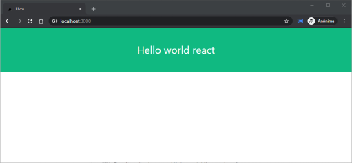
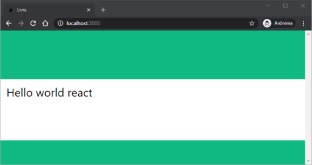
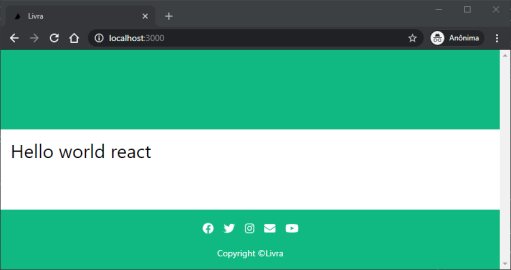
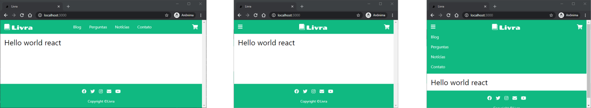
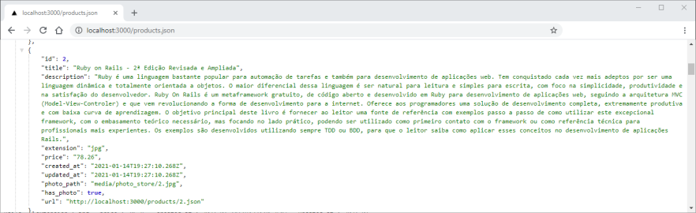
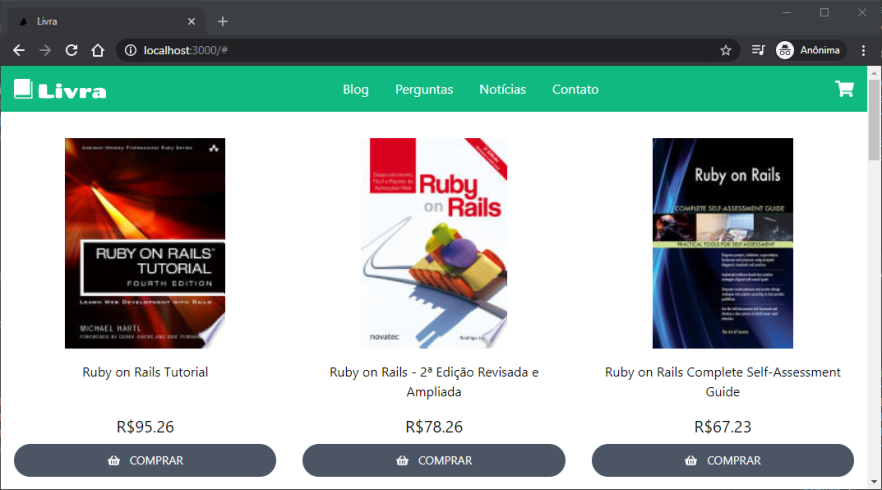
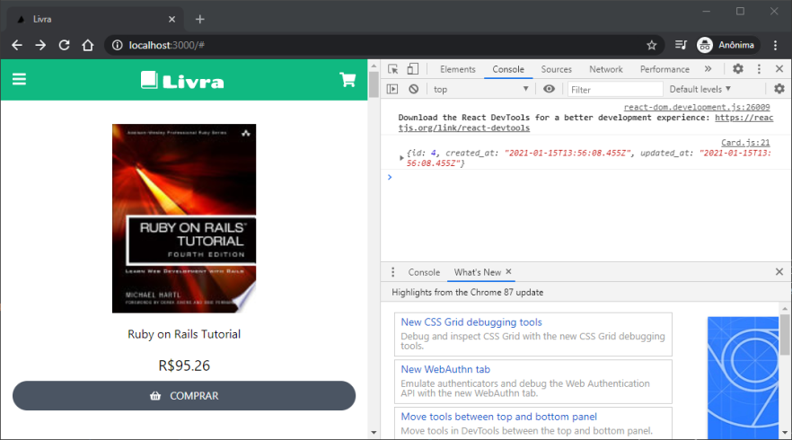
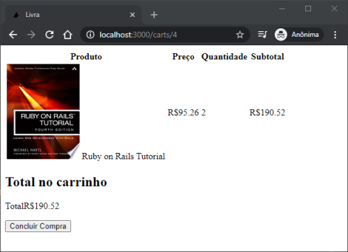

# Ruby on Rails e React: Convertendo a Livraria Virtual em uma SPA (Single Page Application)

## Introdução

Como mencionado na apostila de Javascript/React, os frameworks de Javascript foram criados principalmente para o desenvolvimento de Aplicações de Página Única (_Single Page Applications_ ou SPA). Nesta apostila, demonstraremos o desenvolvimento de uma SPA a partir da adaptação da aplicação de Livraria Virtual desenvolvida anteriormente. Continuaremos com basicamente a mesma aplicação Ruby on Rails no Backend, enquanto que, para o Front-end, será utilizado o framework React.

Em SPAs, a renderização é feita quase complemetamente no browser (cliente), através da manipulação do DOM com código Javascript (ver apostila do Laboratório 3 para relembrar o conceito de renderização no cliente). A atualização do conteúdo da página é feita através de requisições HTTP assíncronas, cujo conteúdo é geralmente formatado em JSON. Assim, o Backend-end deve gerar apenas uma página HTML, que deve fazer o link com os arquivos de Javascript que compõem a aplicação do Front-end.

A principal vantagem de SPAs é a drástica redução do número de recarregamento (_reloading_) completo de páginas. Como as requisições são assíncronas, não é necessário ficar esperando a resposta do servidor a cada requisição HTTP. Além disso, uma vez obtida a resposta, ou seja, os dados requisitados, é possível alterar apenas a parte do DOM (estrutura da página) impactada. Como principal desvantagem das SPAs, é o seu pior desempenho em Otimização para Mecanismos de Buscas (_ Search Engine Optimization_ ou SEO), uma vez que o conteúdo dos arquivos HTMLs que geralmente são analisados nas buscas. Por fim, para páginas estáticas do site, o tempo de resposta é bem mais elevado quando comparado com páginas HTML puras.

## Capítulo 1 - Instalação

Caso você já tenha pronta e funcionando a aplicação da Livraria Virtual em RoR, não é necessário instalar mais nenhum software. Caso contrário, é necessário instalar o Ruby on Rails (veja o procedimento em apostilas anteriores).

O código inicial da aplicação Livraria Virtual pode ser obtido no repositório no seguinte link:
<https://gitlab.uspdigital.usp.br/andre.kubagawa/livra-rails>.

É recomendada a cópia do repositório para sua própria conta do Github ou Gitlab da USP. Assim, você pode gerar os seus própios commits e armazenar no repositório remoto. Para tal, primeiramente crie o seu repositório no GitHub ou Gitlab; por exemplo, em <https://github.com/usuario/livra-rails-react>. Depois, vamos fazer uma clonagem "crua" (sem os arquivos do diretório de trabalho) do repositório da livraria com o comando:

```bash
git clone --bare https://gitlab.uspdigital.usp.br/andre.kubagawa/livra-rails.git
```

Agora vamos fazer o push com "espelhamento" para o seu repositório remoto:

```bash
cd livra-rails.git
git push --mirror https://github.com/usuario/livra-rails-react
```

Pronto, temos o nosso repositório configurado. Podemos, então, apagar a pasta `livra-rails.git` e clonar o novo repositório em outra pasta com:

```bash
cd ..
git clone https://github.com/usuario/livra-rails-react
cd livra-rails-react
```

Com o código da nossa aplicação inicial pronta, devemos instalar as bibliotecas e inicializar o banco de dados. Para isso, podemos executar os comnandos (rails e bundle devem já estar instalados):

```bash
bundle install
yarn install
rails db:migrate
rails db:seed
```

Por fim, para testar se está tudo correto, vamos iniciar a aplicação RoR com:

```bash
rails server
```

Confira em <http://localhost:3000/> se a livraria virtual está operando corretamente. Caso esteja funcionado, podemos prosseguir finalmente com o desenvolvimento da nossa SPA.

## Capítulo 2 - Configurando o React com o Webpacker

Relembrando, uma aplicação SPA utiliza apenas uma página HTML praticamente vazia e grosso o código do Frontend é declarado nos arquivos JS (Javascript). Vamos aplicar essa estrutura e criar a aplicação mais básica possível, ou seja, vamos primeiramente montar uma SPA "_Hello World_".

Para tal, a primeira ação é instalar as bibliotecas React e integrar com o Webpacker. Lembre que o Webpacker é responsável por gerenciar todos os módulos em JS, inclusive os componentes React. Como saída, o Webpacker gera arquivos JS otimizados para serem executados pelo browser; o Webpacker também garante que a página HTML referencie os arquivos JS corretos.

Sendo assim, instale e configure o React no Webpacker com o comando:

```bash
rails webpacker:install:react
```

Agora, vamos editar a página inicial da nossa aplicação, removendo tudo e só retornando um link para o arquivo JS de entrada da nossa SPA React. Para tal, edite o arquivo `pp/views/store/index.html.erb`

```html
<!-- app/views/store/index.html.erb -->
<noscript>You need to enable JavaScript to run this app.</noscript>
<div id="root"></div>
<%= javascript_pack_tag 'index' %>
```

Note que o arquivo `index.js` será linkado no HTML da nossa página solitária. Também precisamos fazer a limpa no leiaute base - edite o arquivo `app/views/layouts/application.html.erb`

```html
<!-- app/views/layouts/application.html.erb -->
<!DOCTYPE html>
<html>
  <head>
    <title>Livra</title>
    <%= csrf_meta_tags %> <%= csp_meta_tag %>

    <meta name="viewport" content="width=device-width, initial-scale=1.0" />
    <link
      href="https://fonts.googleapis.com/css?family=Inter&display=swap"
      rel="stylesheet"
    />
  </head>

  <body>
    <%= yield %>
  </body>
</html>
```

Finalmente, podemos criar nossa aplicação React básica. Lembrando que o ponto de entrada da aplicação é o arquivo `index.js`. Por padrão, o helper `javascript_pack_tag` chamado em `app/views/store/index.html.erb` busca o arquivo JS na pasta `app/javascript/packs`. Por isso, devemos criar o arquivo `app/javascript/packs/index.js` com o conteúdo

```js
// app/javascript/packs/index.js
import React from "react";
import ReactDOM from "react-dom";
import App from "./App";

ReactDOM.render(
  <React.StrictMode>
    <App />
  </React.StrictMode>,
  document.getElementById("root")
);
```

Esse arquivo foi inspirado no criado pelo comando `npx create-react-app` utilizado na apostila de Javascript. Assim, nossa aplicação vai estar contida no componente React `App`. Para criá-lo, vamos criar o arquivo `app/javascript/packs/App.js` com o conteúdo

```js
// app/javascript/packs/App.js
import React from "react";
import "../stylesheets/application.css";

function App() {
  return (
    <div className="w-full flex flex-col items-center justify-center h-32 bg-green-500 text-white">
      <h1 className="text-3xl">Hello world react</h1>
    </div>
  );
}

export default App;
```

Caso não esteja executando, inicie o servidor com `rails server`. Depois, acesse <http://localhost:3000/> e verifique que a nossa SPA _Hello World_ está executando corretamente (como mostrado na figura abaixo).



## Capítulo 3 - Recriando o leiaute base utilizando componentes

No React, o desenvolvimento da aplicação pode ser compartimentalizada em componentes. Isso permite uma maior legibilidade e manutenção do código e também permite a reutilização de componentes. Na linguagem de templates do RoR, isso também era possível, só que com uma flexibilidade bem menor.

Com isso em mente, vamos reescrever o leiaute base em forma de componentes React. Edite o arquivo `app/javascript/packs/App.js`

```js
// app/javascript/packs/App.js
import React from "react";
import "../stylesheets/application.css";

const NavBar = () => <div className="w-full h-32 bg-green-500"></div>; // NavBar temporário
const Footer = () => <div className="w-full h-16 bg-green-500"></div>; // Footer temporário

function App() {
  return (
    <div className="flex flex-col h-screen justify-between overflow-y-scroll">
      <NavBar />
      <main className="w-full max-w-screen-xl mx-auto flex-grow">
        <h1 className="text-3xl p-4">Hello world react</h1>
      </main>
      <Footer />
    </div>
  );
}

export default App;
```

Neste código, o componente App é composto da barra de navegação `<NavBar />`, do conteúdo principal `<main>...</main>` e do rodapé `<Footer />`. A implementação dos dois componentes novos é temporária. Ao abrir a aplicação no browser (em <http://localhost:3000/>), devemos ver a seguinte página:



onde as faixas superior e inferior são os componentes Navbar e Footer, respectivamente.

### 3.1 Implementando o componente Footer

Vamos agora substituir as implementações temporárias dos componentes pela versão real. Começaremos pelo Footer, que é mais simples. Para utilizar os ícones do Fontawesome de modo mais conveniente, podemos instalar algumas bibliotecas do React com os comandos:

```bash
yarn add @fortawesome/fontawesome-svg-core
yarn add @fortawesome/free-solid-svg-icons
yarn add @fortawesome/free-brands-svg-icons
yarn add @fortawesome/react-fontawesome
```

Vamos organizar os arquivos dos nossos componentes desenvolvidos da seguinte forma: primeiro criaremos a pasta `app/javascript/packs/components`; depois, criaremos uma pasta própria para cada novo componente (iniciando com letra maiúscula), sendo o `index.js` o ponto de entrada.

Assim, para o Footer, vamos criar o arquivo `app/javascript/packs/components/Footer/index.js` com o conteúdo

```js
// app/javascript/packs/components/Footer/index.js
import React from "react";
import "../../../stylesheets/application.css";
import { FontAwesomeIcon } from "@fortawesome/react-fontawesome";
import { faEnvelope } from "@fortawesome/free-solid-svg-icons";
import {
  faFacebook,
  faTwitter,
  faInstagram,
  faYoutube,
} from "@fortawesome/free-brands-svg-icons";

const socialMediaIcons = [
  faFacebook,
  faTwitter,
  faInstagram,
  faEnvelope,
  faYoutube,
];

const Footer = () => (
  <footer className="w-full bg-green-500 text-white p-4 flex flex-col justify-center items-center">
    <ul>
      {socialMediaIcons.map((icon, id) => (
        <li key={id} className="inline-block px-2 text-lg">
          <FontAwesomeIcon icon={icon} className="hover:text-gray-300" />
        </li>
      ))}
    </ul>
    <p className="text-sm pt-4">Copyright ©Livra</p>
  </footer>
);

export default Footer;
```

Vamos tecer alguns poucos comentários sobre o código mostrado, que deve ser de relativa fácil compreensão. A principal novidade é o uso da biblioteca `react-fontawesome`, que é importada no início do arquivo e utilizada a partir do componente `FontAwesomeIcon`. Este recebe no seu _props_ o nome do ícone, que deve ser importado de uma dos pacotes de ícones grátis ou pro (ver todas as opções em <https://fontawesome.com/how-to-use/on-the-web/using-with/react>).

Uma vez que o componente está pronto, vamos substituí-lo no App. Para tal, edite o arquivo `app/javascript/packs/App.js`

```js
// app/javascript/packs/App.js
import React from "react";
import "../stylesheets/application.css";
import Footer from "./components/Footer";

const NavBar = () => <div className="w-full h-32 bg-green-500"></div>; // NavBar temporário

function App() {
  return (
    <div className="flex flex-col h-screen justify-between overflow-y-scroll">
      <NavBar />
      <main className="w-full max-w-screen-xl mx-auto flex-grow">
        <h1 className="text-3xl p-4">Hello world react</h1>
      </main>
      <Footer />
    </div>
  );
}

export default App;
```

Ao acessar <http://localhost:3000/>), devemos obter o resultado abaixo:



### 3.2 Implementando o componente NavBar

Agora vamos criar o component Navbar, que é um pouco mais complexo e deve ser responsivo. Crie e pasta `app/javascript/packs/components/NavBar` e o arquivo `index.js` dentro dela. O conteúdo do novo arquivo `app/javascript/packs/components/NavBar/index.js` deve ser

```js
// app/javascript/packs/components/NavBar/index.js
import React from "react";
import "../../../stylesheets/application.css";
import logo from "../../../images/logo.svg";
import Menu from "./Menu";
import MenuButton from "./MenuButton";
import { FontAwesomeIcon } from "@fortawesome/react-fontawesome";
import { faShoppingCart } from "@fortawesome/free-solid-svg-icons";

const Logo = () => ;
const CartIcon = () => (
  <FontAwesomeIcon
    icon={faShoppingCart}
    className="text-white text-xl hover:text-gray-300 hover:bg-transparent md:order-last"
  />
);

class NavBar extends React.Component {
  constructor(props) {
    super(props);
    this.state = {
      menuOpen: false,
    };
    this.handleMenuClick = this.handleMenuClick.bind(this);
  }

  handleMenuClick() {
    this.setState((prevState) => ({ menuOpen: !prevState.menuOpen }));
  }

  render() {
    const { menuOpen } = this.state;
    return (
      <header className="w-full bg-green-500 text-white">
        <div className="max-w-screen-xl mx-auto p-4 flex items-center justify-between flex-wrap">
          <MenuButton onClick={this.handleMenuClick} />
          <Logo />
          <CartIcon />
          <Menu open={menuOpen} />
        </div>
      </header>
    );
  }
}

export default NavBar;
```

Desta vez criamos um componente React de classe, pois ele possui um estado, que armazena se o menu "hamburguer" está aberto ou fechado. Na versão com renderização no servidor (usando apenas o RoR), era inserido um código Javascript com a biblioteca alpinejs para essa função. Como estamos usando o React, isso é incorporada mais naturalmente com o uso da variável de estado como veremos.

Tanto o componente `<Logo />` quanto o `<CartIcon />` já estão definidos no mesmo arquivo. Só falta implementar o `<Menu />` e o `<MenuButton />`. Já nos adiantamos e passamos a função `this.handleMenuClick` para o _props_ do MenuButton a fim de possibilitar que ele modifique o estado (propriedade `menuOpen`). Além disso, o componente Menu deve receber o `menuOpen` para possibilitar que o menu possa ser escondido ou exibido.

Para implementar o MenuButton, crie o arquivo `app/javascript/packs/components/NavBar/MenuButton.js` com o conteúdo

```js
// app/javascript/packs/components/NavBar/MenuButton.js
import React from "react";
import "../../../stylesheets/application.css";
import { FontAwesomeIcon } from "@fortawesome/react-fontawesome";
import { faBars } from "@fortawesome/free-solid-svg-icons";

const MenuButton = (props) => {
  const { onClick } = props;
  return (
    <button className="md:hidden" onClick={onClick}>
      <FontAwesomeIcon
        icon={faBars}
        className="text-white text-xl hover:text-gray-300"
      />
    </button>
  );
};

export default MenuButton;
```

Observe que, ao clicar no botão de "hambúrguer", a variável `menuOpen` deverá ser modificada através da função `onClick` recebida no _props_. Já para implementar o Menu, crie o arquivo `app/javascript/packs/components/NavBar/Menu.js` com o conteúdo

```js
// app/javascript/packs/components/NavBar/Menu.js
import React from "react";
import "../../../stylesheets/application.css";

const menuItems = ["Blog", "Perguntas", "Notícias", "Contato"];

const Menu = (props) => {
  const { open } = props;
  return (
    <nav className="w-full md:w-auto md:block">
      <ul>
        {menuItems.map((item, id) => (
          <li
            key={id}
            className={"pt-4 md:inline md:px-4 " + (!open && "hidden")}
          >
            {item}
          </li>
        ))}
      </ul>
    </nav>
  );
};

export default Menu;
```

Neste código, veja que a variável `open` determina a visibilidade do componente. Isto é feito adicionando a classe `hidden` do tailwincss nos elementos `li` de forma dinâmica.

Uma vez criado o NavBar, vamos reescrever o componente principal no arquivo `app/javascript/packs/App.js`

```js
// app/javascript/packs/App.js
import React from "react";
import "../stylesheets/application.css";
import NavBar from "./components/NavBar";
import Footer from "./components/Footer";

function App() {
  return (
    <div className="flex flex-col h-screen justify-between overflow-y-scroll">
      <NavBar />
      <main className="w-full max-w-screen-xl mx-auto flex-grow">
        <h1 className="text-3xl p-4">Hello world react</h1>
      </main>
      <Footer />
    </div>
  );
}

export default App;
```

Se tudo estiver correto, é esperado que a aplicação fique como a da figura abaixo:



## Capítulo 4 - Utilizando a API Fetch para fazer requisições assíncronas

O próximo passo é montar a página inicial da nossa loja, exibindo os livros cadastrados no banco de dados. Para tal, devemos fazer a requisição HTTP assíncrona da rota `/products.json`, que é configurada automaticamente quando utilizamos o comando `rails scaffold` para gerar o modelo Products no RoR.

Vamos antes personalizar a resposta da rota `/products.json`, que retorna a lista de todos os livros em formato JSON. Desejamos adicionar informações a respeito da foto do livro. Para tal, edite o arquivo `app/views/products/_product.json.jbuilder`

```rb
# app/views/products/_product.json.jbuilder
json.extract! product, :id, :title, :description, :extension, :price, :created_at, :updated_at
json.photo_path product.photo_path # ADICIONE ESTA LINHA
json.has_photo product.has_photo? # ADICIONE ESTA LINHA
json.url product_url(product, format: :json)
```

Para conferir a mudança, podemos acessar a rota <http://localhost:3000/products.json> pelo browser mesmo, que deve exibir algo do tipo:



Para exibir nossa vitrine virtual, vamos criar um novo componente chamado Store. Crie o arquivo `app/javascript/packs/components/Store/index.js` com o conteúdo

```js
// app/javascript/packs/components/Store/index.js
import React from "react";
import "../../../stylesheets/application.css";
import Card from "./Card";

class Store extends React.Component {
  constructor(props) {
    super(props);
    this.state = {
      books: [],
    };
  }

  componentDidMount() {
    fetch("/products.json")
      .then((response) => response.json())
      .then((result) => {
        this.setState({ books: result });
      });
  }

  render() {
    const { books } = this.state;
    return (
      <section className="flex flex-col sm:flex-row sm:flex-wrap">
        {books.map((book) => (
          <Card book={book} key={book.id} />
        ))}
      </section>
    );
  }
}

export default Store;
```

Nesta listagem, a API fetch foi utilizada para fazer a requisição assíncrona para o backend, na rota que configuramos anteriormente. Para entender este código, é necessário relembrar o conhecimento de funções _lifecycle_ do React, que foi discutido na apostila de React. A aplicação final desta apostila é bem parecida com a exibida na listagem acima.

Cada livro é renderizado segundo o componente Card, que deve ser gerado. Para tal, crie o arquivo `app/javascript/packs/components/Store/Card.js` com o conteúdo

```js
// app/javascript/packs/components/Store/Card.js
import React from "react";
import "../../../stylesheets/application.css";
import { FontAwesomeIcon } from "@fortawesome/react-fontawesome";
import { faShoppingBasket } from "@fortawesome/free-solid-svg-icons";
import noImage from "../../../images/no_image.svg";

const Card = (props) => {
  const { book } = props;
  const formattedPrice = parseFloat(book.price).toLocaleString("en-US", {
    minimumFractionDigits: 2,
    maximumFractionDigits: 2,
  });
  return (
    <div className="w-full sm:self-stretch sm:w-1/2 lg:w-1/3 xl:w-1/4 flex flex-col items-center py-8 px-4">
      
      <a
        href="#"
        className="text-base text-center py-4 sm:flex-grow hover:text-gray-500 hover:bg-transparent"
      >
        {book.title}
      </a>
      <p className="text-xl">R${formattedPrice}</p>
      <button className="w-full btn cursor-pointer">
        <FontAwesomeIcon icon={faShoppingBasket} className="text-2xl pr-3" />
        <span className="text-sm">Comprar</span>
      </button>
    </div>
  );
};

export default Card;
```

A única pequena novidade aqui é o uso da função `require`, geralmente adotada para importar pacotes, para importar dinamicamente uma imagem com Webpack.

Por fim, basta incluir o novo componente Store na nossa aplicação principal, editando o arquivo `app/javascript/packs/App.js`

```js
// app/javascript/packs/App.js
import React from "react";
import "../stylesheets/application.css";
import NavBar from "./components/NavBar";
import Footer from "./components/Footer";
import Store from "./components/Store"; // ADICIONE ESTA LINHA

function App() {
  return (
    <div className="flex flex-col h-screen justify-between overflow-y-scroll">
      <NavBar />
      <main className="w-full max-w-screen-xl mx-auto flex-grow">
        <Store /> {/* MODIFIQUE ESTA LINHA */}
      </main>****
      <Footer />
    </div>
  );
}

export default App;
```

Navegue para <http://localhost:3000> para conferir a nova página inicial com os livros:



### 4.1 Implementando requisição POST para compra de livros

Na aplicação original, quando o usuário clica no botão comprar de algum produto, é realiza uma requisição do tipo POST na rota `/line_items`. Na nossa SPA, o mesmo pode ser realizado assincronamente com a API fetch adicionando um argumento adicional a chamada. Para entender melhor, vamos implementar esta modificação; edite o arquivo `// app/javascript/packs/components/Store/Card.js`

```js
// app/javascript/packs/components/Store/Card.js
import React from "react";
import "../../../stylesheets/application.css";
import { FontAwesomeIcon } from "@fortawesome/react-fontawesome";
import { faShoppingBasket } from "@fortawesome/free-solid-svg-icons";
import noImage from "../../../images/no_image.svg";

function postLineItem(id) { // ADICIONE ESTA FUNÇÂO
  const csrf = document
    .querySelector("meta[name='csrf-token']")
    .getAttribute("content");
  const requestOptions = {
    method: "POST",
    headers: {
      "Content-Type": "application/json",
      "X-CSRF-Token": csrf,
    },
    body: JSON.stringify({ product_id: id }),
  };
  fetch("/line_items.json", requestOptions)
    .then((response) => response.json())
    .then((data) => console.log(data));
}

const Card = (props) => {

  ...

      <p className="text-xl">R${formattedPrice}</p>
      <button onClick={() => postLineItem(book.id)} className="w-full btn cursor-pointer"> {/* MODIFIQUE ESTA LINHA */}
        <FontAwesomeIcon icon={faShoppingBasket} className="text-2xl pr-3" />
        <span className="text-sm">Comprar</span>
      </button>
    </div>
  );
};

export default Card;
```

O método (POST), assim como campos de cabeçalhos HTTP, todos armazenados na variável `requestOptions`, devem ser passados no segundo argumento da função `fetch`, como mostrado no código. O campo `X-CSRF-Token` é necessário para aplicações RoR, pois esta proteção é inserida por padrão. Na prática, as rotas POSTS são apenas acessíveis para usuários autenticados e, portanto, podemos remover essa proteção e, consequentemente, não necessitariamos desse cabeçalho.

Note que estamos fazendo o _print_ da resposta do servidor por motivos de depuração apenas. Assim, podemos verificar se está funcionando clicando o botão e checando a saída no console, como mostrado na figura:



Lembre que a resposta do POST na rota `/line_items` retorna dados do carrinho. Assim, podemos deduzir que o item foi inserido no carrinho com o _id_ 4 e, checando em <http://localhost:3000/carts/4>, verificamos que o livro realmente está no carrinho:



## Capítulo 5 - Criando componentes funcionais com estado utilizando Hooks

## Capítulo 6 - Configurando Rotas com o React Router

<!-- ## Capítulo 7 - Compartilhando o estado entre componentes com o Context -->

<!-- ## Capítulo 8 - Adicionando autenticação com JWT -->
